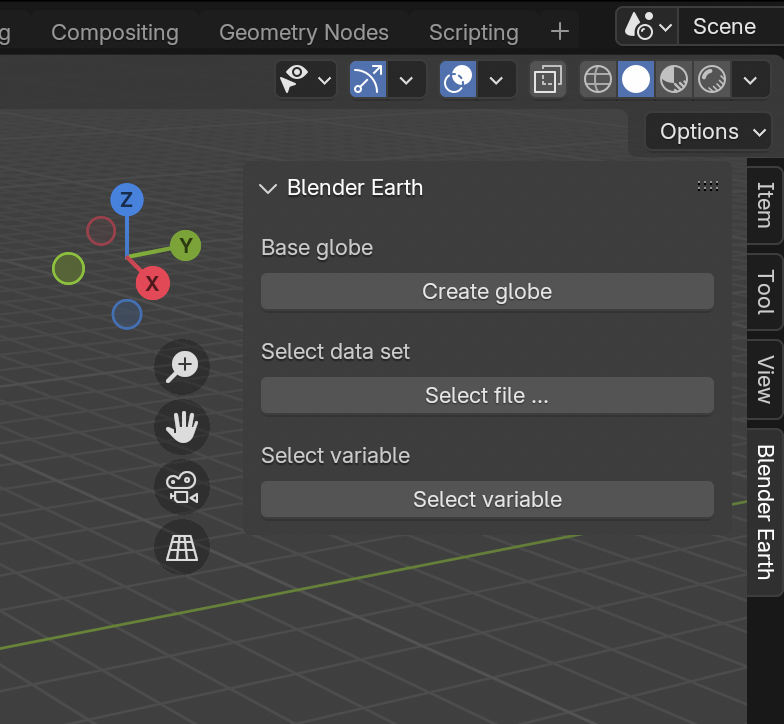

# bl_earth
Blender add-on to overlay model data on the globe

**bl_earth** is a [**Blender**](https://www.blender.org) Python addon to visualize global model data on top of a three-dimensional globe. Model data will be handle through **zarr** and theerfore can come in various formats, such as **netCDF** and **grib**.

#### Why bl_earth?

There have been many packages providing starting points to visualise model data in Blender. For example, BlenderNC already allowed the loading of NetCDF and GRIB data using xarray, but it still requires a bit of manual work. Thsi is a privaye project to explore more options to use the power of xarray and generally leearn the tools ... 


Documentation
-------------

No *bl_earth* documentation yet. You are looking at what exist on this page! Not sure if it will ever come, as this is a private project for myself to learn Blender python scripting and working with GitHub copilot.

Installation
------------

**bl_earth** is now a Blender extension! There are several ways to install it:

### Option 1: Install from Extension Platform (COMING SOON)
1. Open Blender 4.2 or later
2. Go to Edit > Preferences > Extensions
3. Search for "bl_earth" and install directly

### Option 2: Install from ZIP file
1. Download the latest release from GitHub
2. In Blender, go to Edit > Preferences > Extensions
3. Click "Install from Disk" and select the ZIP file
4. Enable the extension

### Option 3: Install from Source and run from within VS Code
Clone the repository and install dependencies:

``` bash
   git clone https://github.com/StephanSiemen/bl_earth
   cd bl_earth
```

<!--

Find your Blender Python executable:
``` bash
   export BLENDER_PYTHON=$(blender -b -q --python-expr "import sys; print(sys.executable)" | sed -n 1p)
```

Install dependencies:
``` bash
   $BLENDER_PYTHON install_dependencies.py
```
-->
Then in VS Code:

 - Make sure you have the ["Blender Development"](https://marketplace.visualstudio.com/items?itemName=JacquesLucke.blender-development) extension by Jaques Lucke installed

 - Open folder wher you cloned this GitHub repositry
 
 - Cmd+Shift+P and type/select "Blender: Start"

 - You should find the extension installed and you can start typing "N" in Blender

Running bl_earth
----------------

- **Interactivly in Blender**

  After installing and enabling the **bl_earth** extension, go to the Layout workspace (should be default) and activate the side menu in the main 3D view Editor by pressing 'N'. You should see a tab called "Blender Earth". If not please, please restep the add-on installation.

  After installing the extension, you can find the **bl_earth** menu on the sidebar by pressing 'N' in the 3D viewport:
  

- **Command line and batch**

  Clone the [**bl_earth**](https://github.com/StephanSiemen/bl_earth) repo to where you want to run it, install the third-aprty dependencies and excute something like this 
  ``` bash
    blender --background --python bl_earth.py -noaudio -E 'CYCLES' -f 1 -F 'PNG' -- data/ecmwf_forecast.grib2 
  ```
  Where $BLENDER_PYTHON is pointing to the Python interpretor which comes with Blender (see above). To retrieve the example data set, run '$BLENDER_PYTHON retrieve_ecmwf_fc.py' in the 'data' folder.

Development
-----------

### Building the Extension
To create a distributable extension package:

``` bash
   python3 build_extension.py
```

This creates `dist/bl_earth-extension.zip` which can be installed in Blender.


Contributing
------------

All contributions, bug reports, bug fixes, documentation improvements, enhancements, and ideas are welcome. 

Use Github to:
- report bugs,
- suggest features,
- provide examples

Inspiration
-----------

This modeule was inspired by many other projects like 

- [blendernc](https://blendernc.readthedocs.io)


Acknowledgement
---------------

The used texture and topolgies orginate from NASA's Visible Earth and used according to [their usage policy](https://visibleearth.nasa.gov/image-use-policy). The files itself were provided as part of [this Blender Guru's YouTube tutorial](https://www.youtube.com/watch?v=0YZzHn0iz8U).

---

#### Authors
[@stephansiemen](https://github.com/stephansiemen)

Disclaimer: This development was done using AI tools, especially GitHub Copilot.

#### Contributors
