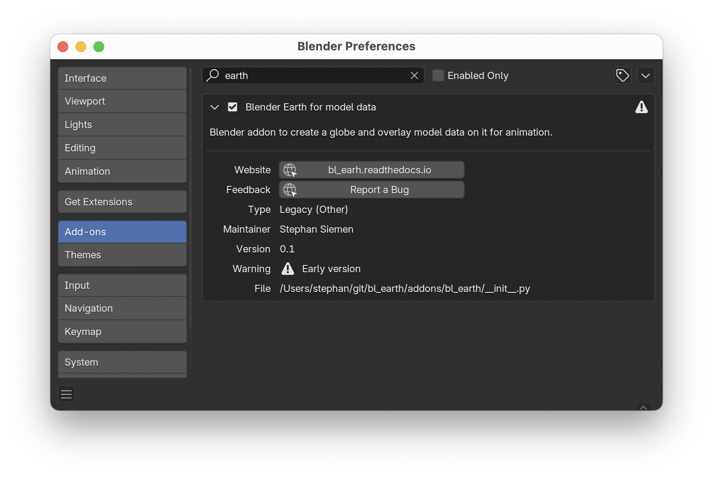

# bl_earth
Blender add-on to overlay model data on the globe

**bl_earth** is a [**Blender**](https://www.blender.org) Python addon to visualize global model data on top of a three-dimensional globe. Model data will be handle through **zarr** and theerfore can come in various formats, such as **netCDF** and **grib**.

#### Why bl_earth?

There have been many packages providing starting points to visualise model data in Blender. For example, BlenderNC already allowed the loading of NetCDF and GRIB data using xarray, but it still requires a bit of manual work. Also there are limited options to use the power of xarray and therfore a new approach was necessary ... 


Documentation
-------------

Learn more about *bl_earth* in the official documentation at ... COMING SOON!

Installation
------------

To use **bl_earth** interactivly in the Blender UI you need to install the addon, through Edit > Preferences > Add-ons. To use it in batch mode, you only need to clone the GitHub repositry itself. Additionally some third-party Python packages need to be installed with the Blender Python interpretor. The latter is slightly more complicated, as you need to call the Python executable which comes with Blender. To do so you need to know where Blender is installed (depends on your operating system and Blender version). One way to find out is to call this command if you have blender in your PATH:

``` bash
   blender -b --python-expr "import sys; print(sys.executable)"
   export BLENDER_PYTHON=<output path from above>
```

When you know where your python interpretor is located (here an example on MacOS) you can install Python community packgages with

``` bash
   git clone https://github.com/StephanSiemen/bl_earth
   cd bl_earth
   /Applications/Blender.app/Contents/Resources/4.3/python/bin/python3.11 -m pip install -r requirements.txt
```

Running bl_earth
----------------

- **Interactivly in Blender**

  After installing and enabling the **bl_earth** add-on, go to the Layout workspace (should be default) and activate the side menu in the main 3D view Editor by pressing 'N'. You should see a tab called "Blender Earth". If not please, please restep the add-on installation.

  If you checked out this repo and want to run it locally from code you should go to the git folder and set the path by setting 
  ``` bash
    export BLENDER_SYSTEM_SCRIPTS=$PWD
  ```
  After that you start up Blender and enable the addon under Edit - Preferences, searching for 'earth':
  
  When enabled you can find the **bl_earth** menu on the sidebar tyoing 'n' in the main window:
  

- **Command line and batch**

  Clone the [**bl_earth**](https://github.com/StephanSiemen/bl_earth) repo to where you want to run it, install the third-aprty dependencies and excute something like this 
  ``` bash
    blender --background --python bl_earth.py -noaudio -E 'CYCLES' -f 1 -F 'PNG' -- data/ecmwf_forecast.grib2 
  ```
  Where $BLENDER_PYTHON is pointing to the Python interpretor which comes with Blender (see above). To retrieve the example data set, run '$BLENDER_PYTHON retrieve_ecmwf_fc.py' in the 'data' folder.

Contributing
------------

All contributions, bug reports, bug fixes, documentation improvements, enhancements, and ideas are welcome. More information about contributing to bl_earth can be found at our [Contribution page](https://bl_earth.readthedocs.io/en/latest/contribute.html).

Use Github to:
- report bugs,
- suggest features,
- provide examples

Inspiration
-----------

This modeule was inspired by many other projects like 

- [blendernc](https://blendernc.readthedocs.io)


Acknowledgement
---------------

The used texture and topolgies orginate from NASA's Visible Earth and used according to [their usage policy](https://visibleearth.nasa.gov/image-use-policy). The files itself were provided as part of [this Blender Guru's YouTube tutorial](https://www.youtube.com/watch?v=0YZzHn0iz8U).

---

#### Authors
[@stephansiemen](https://github.com/stephansiemen)


#### Contributors
